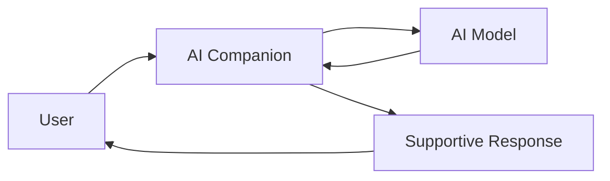
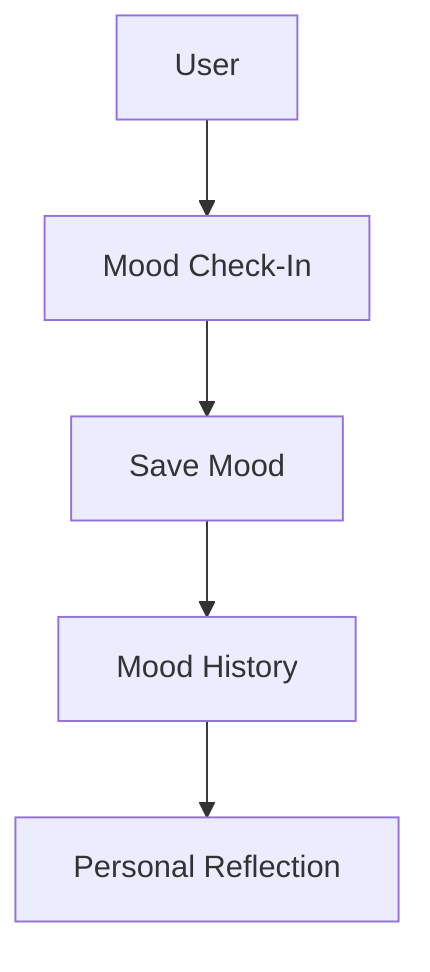
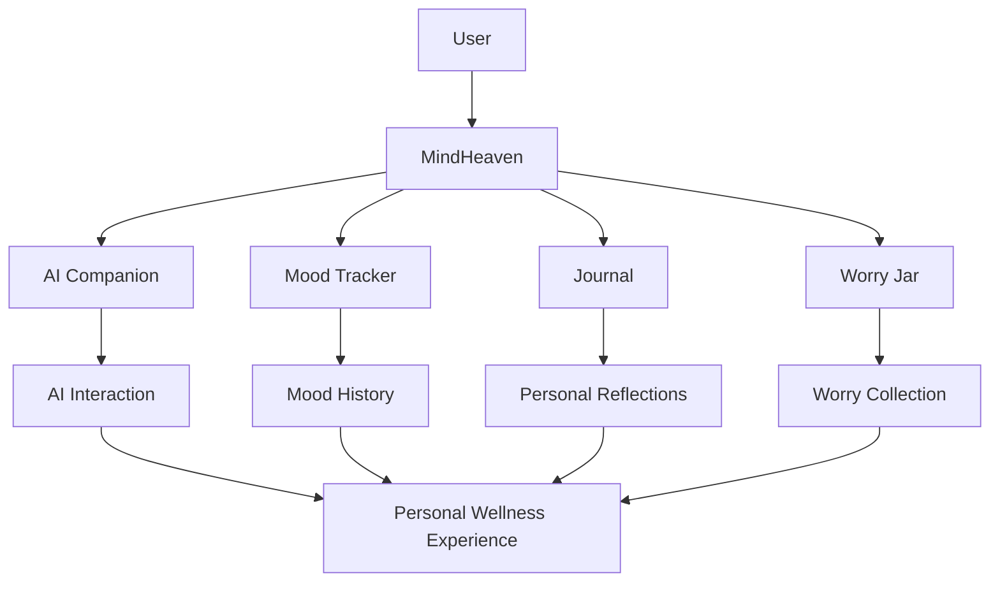
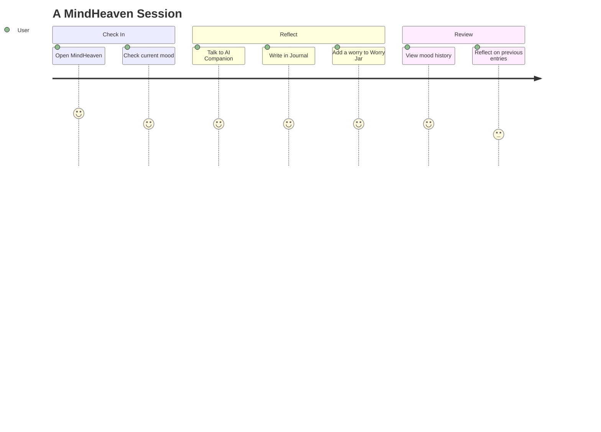
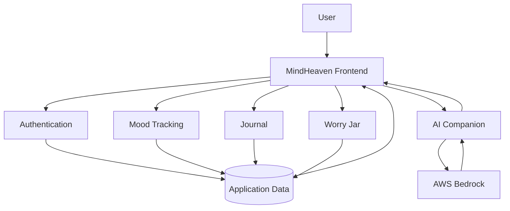

# MindHeaven

> A digital space for reflection, emotional wellness, and everyday support.

**MindHeaven** is a digital mental wellness platform designed to give users a calm space to reflect, understand their emotions, and build healthier everyday habits.

It combines an **AI companion, mood tracking, journaling, and a worry jar** into one experience, with the goal of making emotional self-care approachable and accessible.

---

## Overview

MindHeaven is built around the idea that mental wellness is not only about seeking help when something goes wrong — it can also involve small, consistent moments of reflection.

The platform brings together tools that support different parts of that process:

* Talk with an AI companion
* Track your mood
* Write and reflect through journaling
* Put worries into a digital worry jar
* Build a personal record of emotional reflections

The experience is designed to be calm and personal rather than clinical or overwhelming.

---

## Features

### AI Companion

MindHeaven includes an AI-powered companion designed for supportive everyday conversations.

Users can interact with the companion through natural language and use it as a space to express thoughts or reflect on how they are feeling.



---

### Mood Tracker

Users can record how they are feeling and build a history of their emotional check-ins.

This can help users reflect on:

* Current mood
* Changes over time
* Emotional patterns
* Personal well-being habits



---

### Journal

A dedicated space for writing thoughts, experiences, and reflections.

Journaling can be used for:

* Daily reflections
* Expressing emotions
* Recording experiences
* Organizing thoughts

---

### Worry Jar

The Worry Jar provides a dedicated place to write down worries instead of keeping them in your head.

The concept is intentionally simple:

```text
Identify the worry
       ↓
Write it down
       ↓
Place it in the Worry Jar
       ↓
Create some mental distance
       ↓
Return when you're ready
```

It turns an abstract thought into something visible and contained.

---

## How It Works



MindHeaven brings these experiences together instead of treating them as isolated features.

---

## User Journey



---

## Architecture



---

## AI Companion

The AI component uses **AWS Bedrock** to power the conversational experience.

The general interaction flow is:

```text
User
  │
  ▼
MindHeaven UI
  │
  ▼
AI Companion
  │
  ▼
AWS Bedrock
  │
  ▼
Generated Response
  │
  ▼
MindHeaven UI
```

The AI companion is intended for supportive everyday interaction and reflection rather than diagnosis or treatment.

---

## Tech Stack

### Frontend

* Web-based frontend
* HTML
* CSS
* JavaScript

### AI

* AWS Bedrock
* AI-powered conversational companion

### Data & Application Services

* Authentication
* Persistent application data
* Mood records
* Journal entries
* Worry Jar entries

> Keep this section synchronized with the actual repository implementation if the project uses a specific frontend framework, database, authentication provider, or additional AWS services.

---

## Project Structure

```text
mindheaven/
│
├── src/
│   ├── components/
│   ├── pages/
│   ├── services/
│   └── ...
│
├── public/
│   └── ...
│
├── assets/
│   └── ...
│
├── README.md
└── ...
```

---

## Getting Started

### Clone the repository

```bash
git clone https://github.com/the-nidhi-bhat/mindfullheaven_prodiction.git
cd mindfullheaven_prodiction
```

### Install dependencies

If the project uses Node.js:

```bash
npm install
```

### Configure environment variables

Create the environment file required by the project and add the necessary configuration values.

For example:

```text
AWS_ACCESS_KEY_ID=your_access_key
AWS_SECRET_ACCESS_KEY=your_secret_key
```

**Never commit credentials, API keys, or other secrets to the repository.**

Use the project's actual environment-variable names when configuring a local deployment.

### Start the development server

```bash
npm run dev
```

Then open the local URL shown by the development server.

---

## Design Philosophy

### Calm

The interface aims to create an environment where users can slow down and reflect.

### Personal

Mood records, journals, worries, and AI conversations can represent different parts of a user's individual experience.

### Simple

Wellness tools should not require complicated workflows.

### Supportive

MindHeaven is designed to complement everyday self-care rather than replace professional mental-health support.

---

## Privacy & Security

Mental wellness applications can handle highly personal information.

MindHeaven should therefore treat information such as:

* Journal entries
* Mood history
* Worry Jar entries
* AI conversations
* Authentication information

as sensitive application data.

Production deployments should use appropriate authentication, authorization, secure storage, protected API credentials, and least-privilege access.

**Never expose AWS credentials or other secrets in frontend code or commit them to Git.**

---

## Responsible AI

The AI companion is intended to support everyday reflection and conversation.

It should **not** be considered:

* A medical professional
* A diagnostic system
* A replacement for therapy
* A crisis-response service
* A source of emergency medical advice

For situations involving immediate danger or a mental-health emergency, users should seek appropriate professional or emergency assistance.

---

## Future Improvements

Potential directions for MindHeaven include:

* [ ] More personalized AI conversations
* [ ] Mood trend visualizations
* [ ] Personalized wellness recommendations
* [ ] Improved journal organization
* [ ] Search and filtering for journal entries
* [ ] More meditation and mindfulness experiences
* [ ] Enhanced privacy controls
* [ ] Accessibility improvements
* [ ] Better crisis-support pathways
* [ ] Counselor discovery and connection
* [ ] Mobile/PWA experience

---

## Project Status

MindHeaven is an evolving digital wellness project exploring how **AI and simple reflection tools** can be combined into a single user experience.

The current concept focuses on four core experiences:

**AI Companion · Mood Tracking · Journaling · Worry Jar**

---

## Topics

```text
mental-wellness
mental-health
wellness
self-care
ai
ai-companion
aws
aws-bedrock
mood-tracker
journaling
worry-jar
emotional-wellness
digital-wellness
web-app
```

---

## Disclaimer

MindHeaven is a digital wellness project intended for everyday emotional reflection and self-care. It does not provide medical diagnosis, treatment, or emergency intervention.

---

### A calmer space to pause, reflect, and take care of your mind.
